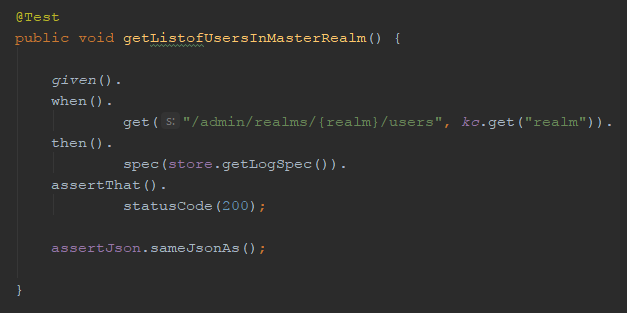
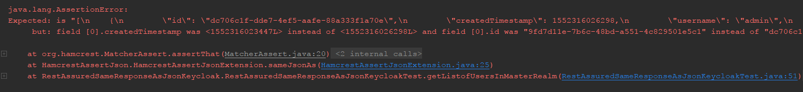
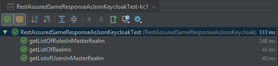
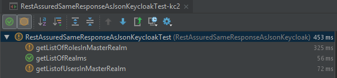
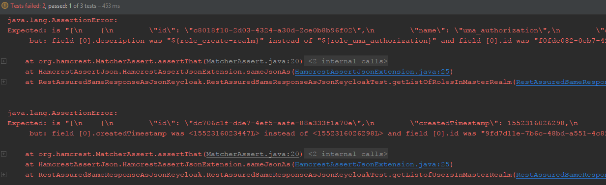

# restassured_same-response-as_keycloak
## A RestAssured REST API client to assert actual against expected Json responses
### applied on Keycloak authentication server

***
*This repository in a series of similar repositories for API testing intended for a specific workflow that compares expected against actual API responses*

### (I) The problem
The following are typical workflows for API development

#### Regression testing of an existing API or backend
1. Sending requests to the endpoints of an API as tests and recording the expected responses
2. Modifying the API or backend
3. Sending same requests to the API and recording actual responses
4. Comparing expected against actual responses and derive conclusions that can lead to further refactoring

#### Development of a new API
Running a predefined set of API requests as tests and develop API endpoints and backend until these API tests no longer fail - a special case of test-driven development (TDD)

### Integration testing at API-level
API testing can be used as part of the integration testing phase when individual software modules are combined and tested as a group.

### (II) A solution attempt with RestAssured

Using
* `RestAssured` as powerful REST API client,
* `Hamcrest-Json` to compare Json responses and the
* `Keycloak Admin API` in combination with `Docker` as a REST API for testing

### (III) How to get started
* IntelliJ IDEA is the recommended Java IDE
* `.idea/runConfigurations` contains some Run Configuration examples and maven configurations that you can immediately use after you have imported via `File > New > Project from Existing Sources...` in IDEA.
* For testing you can quickly spin-up 1 or 2 docker containers (each container a Keycloak auth server) by using the docker files in the `docker` folder und following the instructions of this [keycloak_full-export](https://github.com/raketensilo/keycloak_full-export) repository.

### (IV) Usage instructions
#### 1. Test example

#### 2. Run group of tests against kc1 (Keycloak 1) to record expected responses

#### 3. Re-run group of tests against kc2 to compare actual and expected response

